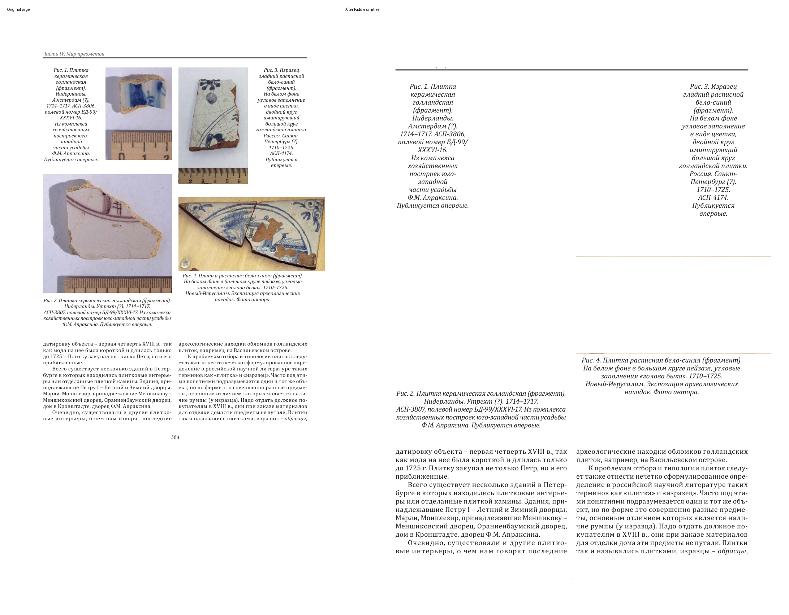
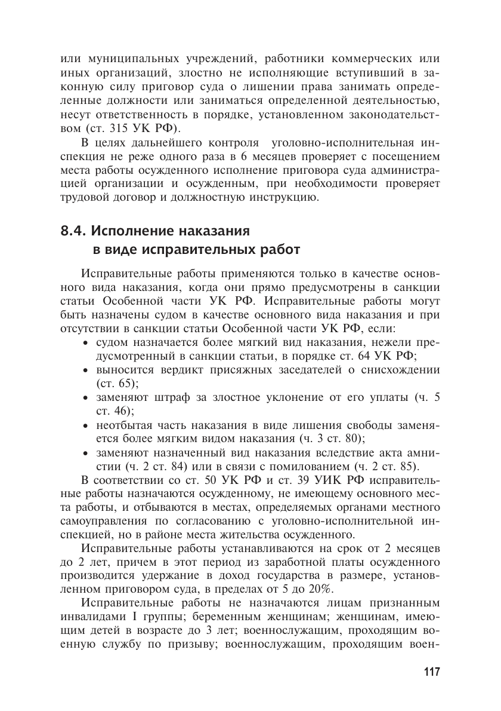
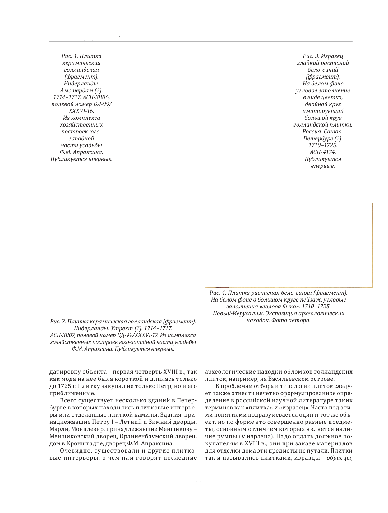

# Russian Data Cleaning Agent Demo

This folder is a lightweight public-facing demo package extracted from the main project:

- purpose: show the problem, the pipeline, and a small before/after example without opening the full workspace first
- this repo is intentionally a demo package, not the full codebase

## Start Here

1. Read [docs/PROJECT_README.md](docs/PROJECT_README.md)
2. Read the English walkthrough in [docs/INTERVIEW_DEMO.md](docs/INTERVIEW_DEMO.md)
3. Read the Chinese overview in [docs/DEMO_CN.md](docs/DEMO_CN.md)
4. Open the original input page in [sample_input/page_0001_original.png](sample_input/page_0001_original.png)
5. Compare it with the sanitized page and JSON in [sample_output](sample_output)

## What's Included

- `docs/PROJECT_README.md`
  - high-level project introduction and architecture
- `docs/INTERVIEW_DEMO.md`
  - English walkthrough of the demo package
- `docs/DEMO_CN.md`
  - Chinese project overview
- `sample_input/page_0001_original.png`
  - original page image used for the demo
- `sample_output/penitentiary_smoke_p118_121.layout_ocr.json`
  - Paddle layout output with keep/mask regions
- `sample_output/page_0001_sanitized.png`
  - one sanitized page after layout masking
- `sample_output/Жизнь_и_смерть_...txt`
  - a real cleaned output example from a larger book
- `sample_output/Международное_право_...txt`
  - another cleaned output example from a legal text

## Recommended Viewing Order

1. Show the original input page image.
2. Show the sanitized page image and explain that `title/body` are kept while `note/picture/table` are masked.
3. Show the cleaned TXT output.
4. Then explain the pipeline and the engineering decisions.

## Visual Before/After

Side-by-side comparison:

Original page:

Sanitized page:

## What This Demo Represents

This project is not just OCR.

It is a recoverable, page-state-driven Russian document cleaning pipeline for long academic, legal, and historical PDFs. The key value is:

- layout filtering before OCR/extraction
- page routing to avoid unnecessary heavy processing
- deterministic post-cleaning for recurring OCR errors
- checkpoint/resume for long-running book jobs

## If You Need The Full Repo

The full project codebase is kept separately from this demo package.
