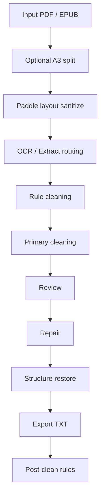

# Russian Data Cleaning Agent

A document cleaning pipeline for noisy Russian PDFs and EPUBs.

This project is built for a very specific problem: academic, legal, and historical Russian documents are often not usable after plain OCR. They contain mixed text/image pages, footnotes, figure captions, running headers, A3 spreads, broken paragraph structure, and OCR-specific Cyrillic errors. This repository turns those files into cleaner plain-text corpora that are usable for research and RAG.

## Problem

Plain OCR is not enough for Russian research documents.

Typical failures:

- page headers and page numbers get merged into body text
- footnotes and bibliography blocks pollute the main text
- figure captions stay inside paragraphs
- A3 two-page scans confuse layout analysis
- OCR introduces broken hyphenation and merged words
- long books fail halfway without checkpointing

The goal of this project is not “do OCR once.” The goal is to build a recoverable, inspectable pipeline that can process full books and produce cleaner research text.

## What This System Does

This is the current real workflow:

1. Optional manual coarse cleanup
   - delete obvious full-page pictures, tables of contents, full-page references, etc.
2. Optional PDF split for landscape/A3 spreads
3. Paddle-based layout sanitization
   - keep `title/body`
   - mask `note/picture/table`
4. OCR / text extraction routing
   - prefer PDF text extraction when good enough
   - use OCR only on pages that need it
5. Rule cleaning
6. Model cleaning / escalation
7. Review
8. Repair
9. Structure restore
10. Export + final rule-based post-clean

## Architecture



## Core Design

This is not a single free-form “agent.”

It is a page-state-driven document pipeline with narrow, testable responsibilities:

- entrypoint: `scripts/process_books.py`
- state object: `src/russian_data_cleaning/state_models.py`
- state machine: `src/russian_data_cleaning/state_machine.py`
- page routing: `src/russian_data_cleaning/page_commander.py`
- OCR/extract: `src/russian_data_cleaning/ocr_agent.py`
- rules cleaning: `src/russian_data_cleaning/cleaning_agent.py`
- review: `src/russian_data_cleaning/review_agent.py`
- repair: `src/russian_data_cleaning/deepseek_repair_agent.py`
- structure: `src/russian_data_cleaning/deepseek_structure_agent.py`
- final post-clean: `scripts/post_clean_final_txt.py`

Current main state flow:

`NEW -> EXTRACTED|OCR_DONE -> RULE_CLEANED -> PRIMARY_CLEANED -> REVIEWED -> REPAIRED -> STRUCTURE_RESTORED -> EXPORTED`

Failed pages move to `FAILED`, and resume continues from `last_success_state` rather than restarting the whole book.

## Current Backends

Default `balanced_cost` profile:

- OCR: `Qwen`
- layout sanitize: `Paddle`
- cleaning: `DeepSeek`
- cleaning escalation: `DeepSeek`
- review: `heuristic`
- repair: `DeepSeek`
- repair escalation: `DeepSeek`
- structure: `DeepSeek`

Supported components:

- Qwen OCR via DashScope
- DeepSeek chat/completions
- Gemini as optional higher-cost path
- Paddle locally for layout sanitization
- Tesseract as local OCR fallback

## Why This Project Is Interesting

This project is not just model orchestration. The engineering work is the point.

Key problems solved:

- page-level checkpointing and resume for long-running book processing
- separation of OCR, diagnosis, repair, and structure restoration responsibilities
- layout-based masking before OCR/extraction
- A3 landscape spread splitting before layout analysis
- export-time cleanup for figure captions, hyphenation, mixed-script OCR noise, and backmatter
- cost/latency tradeoffs through `balanced_cost` and `max_quality` profiles

## Quick Demo

### 1. Prepare environment

```bash
export DASHSCOPE_API_KEY="your-qwen-key"
export DEEPSEEK_API_KEY="your-deepseek-key"
```

Optional if you want the higher-cost Gemini path:

```bash
export GEMINI_API_KEY="your-gemini-key"
```

### 2. If the PDF is a landscape double-page scan, split it first

```bash
python3 scripts/split_landscape_pdf.py \
  --input '5/YourBook.pdf' \
  --output '5/YourBook_split.pdf'
```

### 3. Run the main pipeline

```bash
python3 scripts/process_books.py \
  --profile balanced_cost \
  --book '5/YourBook_split.pdf' \
  --run-root outputs/full_book_runs/demo_run \
  --final-txt-dir outputs/final_txt \
  --resume \
  --prevent-sleep
```

### 4. Inspect outputs

Main artifacts:

- `outputs/full_book_runs/<run>/.../ocr.json`
- `outputs/full_book_runs/<run>/.../rule_cleaned.json`
- `outputs/full_book_runs/<run>/.../cleaned_primary.json`
- `outputs/full_book_runs/<run>/.../repaired.json`
- `outputs/full_book_runs/<run>/.../page_states/*.json`
- `outputs/final_txt/<book>.txt`

If Paddle layout sanitize is enabled, you also get:

- `layout_sanitize/*.layout_ocr.json`
- `layout_sanitize/*.sanitized_pages/page_XXXX.png`

## Recommended Demo For Interviews

Do not demo an 800-page book.

Use a 3-10 page sample that contains:

- one normal body page
- one page with figure captions or notes
- one page with OCR-sensitive formatting

Show three things only:

1. the noisy input page
2. the sanitized intermediate result
3. the final cleaned text

There is a dedicated interview/demo guide here:

- [docs/INTERVIEW_DEMO.md](docs/INTERVIEW_DEMO.md)

## Example Talking Point

This is the one-sentence version for interviews:

> I built a stateful Russian document cleaning pipeline that combines layout masking, OCR/extract routing, LLM-based cleaning/repair, and export-time rule cleanup to turn noisy academic/legal PDFs into cleaner text corpora for research and RAG.

## Quality Strategy

The project now includes a minimal quality baseline scaffold:

- golden sample directory: `golden_samples/`
- evaluator entrypoint: `scripts/evaluate_golden_samples.py`

Implemented first-pass metrics:

- normalized edit distance
- keyword retention
- structure overreach placeholder
- Russian anomaly counts
- page type misclassification placeholder

## Current Limitations

This system is useful, but it is not a perfect document AI stack.

Known limitations:

- layout masking is conservative, not perfect
- some figure captions still require rule iteration on new document styles
- OCR errors in difficult scans still need post-clean rules
- review/repair quality depends on page type and source PDF quality
- public quality benchmarking still needs a hand-labeled golden sample set

## Repository Map

Important files:

- `scripts/process_books.py`
- `scripts/post_clean_final_txt.py`
- `scripts/run_paddle_layout_ocr.py`
- `scripts/split_landscape_pdf.py`
- `scripts/evaluate_golden_samples.py`
- `src/russian_data_cleaning/ocr_agent.py`
- `src/russian_data_cleaning/cleaning_agent.py`
- `src/russian_data_cleaning/page_commander.py`
- `src/russian_data_cleaning/deepseek_cleaning_agent.py`
- `src/russian_data_cleaning/deepseek_repair_agent.py`
- `src/russian_data_cleaning/deepseek_structure_agent.py`
- `src/russian_data_cleaning/paddle_layout_baseline/`

## Good Fit For

This repository is best framed as:

- an applied NLP / document AI project
- an LLM systems / agentic workflow project
- a research data engineering project
- a long-document OCR cleaning pipeline

It is not best framed as:

- a general chat agent
- a polished SaaS product
- a pure OCR benchmark

## License / Use

This repository is currently organized as a working research/engineering project. If you plan to publish it publicly, review:

- sample data licensing
- API key handling
- whether `outputs/` and local personal materials should be excluded

